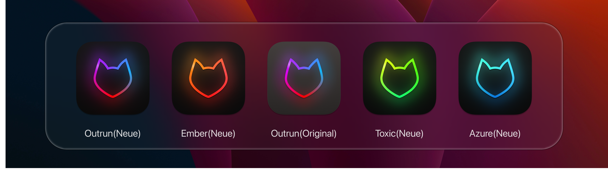

# Kitty App Icon 



A set of alternative app icons for [Kitty](https://sw.kovidgoyal.net/kitty/).


## Installation

### MacOS

1. Find `kitty.app` in the `Applications` folder, select it and press `⌘ + i`.
2. Drag the `.icns` file for your favourite variant from `build/` onto the application icon in the `kitty info` pane.
3. Delete the icon cache and restart `Dock`:

```bash
$ rm /var/folders/*/*/*/com.apple.dock.iconcache; killall Dock
```

### Linux

1. Locate the kitty logos in `/usr/lib/kitty/logo`
2. Backup existing `kitty.png` & `kitty-128.png` (may need to do this as root, depending on how you installed kitty)
3. Locate your favourite variant in `build/`
4. Copy `icon_128x128.png` to `/usr/lib/kitty/logo` rename to `kitty-128.png`
5. Copy `icon_32x32.png` to `/usr/lib/kitty/logo` and rename to `kitty.png`
6. (optional) Depending on your DE and installation you may need to change the launcher icon. For xfce you can press super + space and search for kitty, right click on the result and click edit application. From there you can swap out the icon with one from this repository.

## Other alternatives

* [Icon by DinkDonk](https://github.com/DinkDonk/kitty-icon)
* [Icon by hristost](https://github.com/hristost/kitty-alternative-icon)
